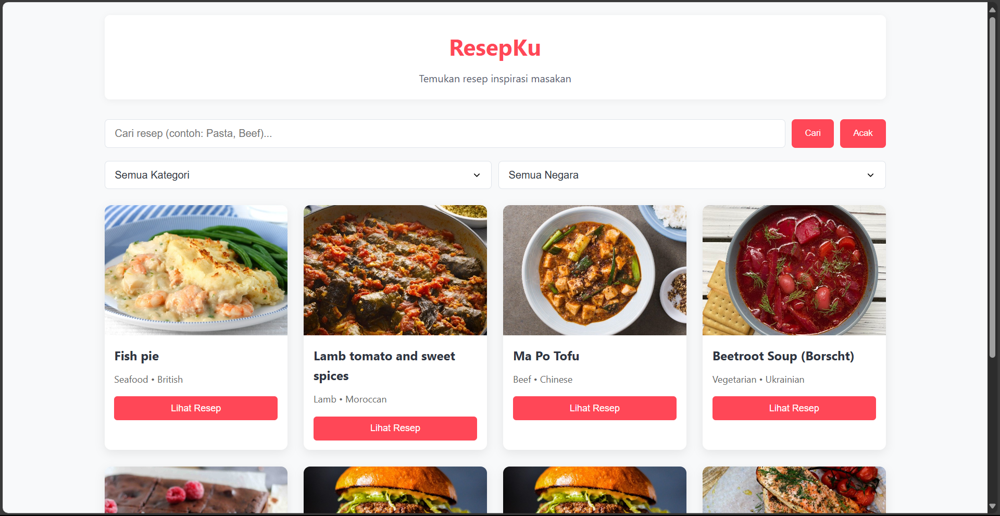
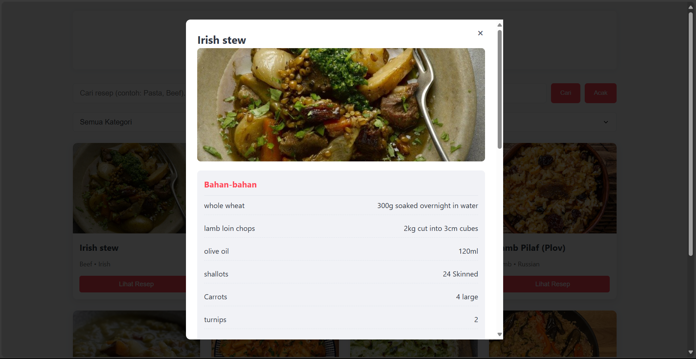

# ResepKu
## Deskripsi
ResepKu adalah aplikasi pencarian resep masakan berbasis web yang menggunakan API dari TheMealDB. Dibangun dengan React, aplikasi ini memungkinkan pengguna untuk mencari resep berdasarkan nama masakan, memfilter berdasarkan kategori atau negara asal, serta mendapatkan resep acak.
## Fitur Utama
- Pencarian resep berdasarkan nama
- Filter berdasarkan kategori dan negara asal
- Resep acak untuk inspirasi
- Tampilan detail resep lengkap dengan bahan dan langkah memasak
## Screen Shot
### Landing Page

### Recipe Details
